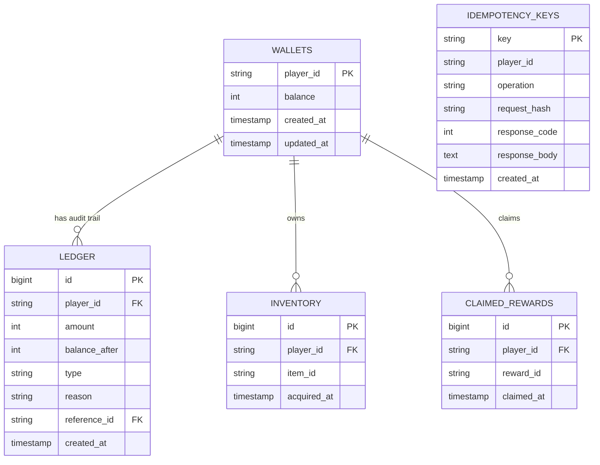

# Arcfield — System Architecture & Design Decisions

This document details the architectural decisions, database design, and durability guarantees of the Arcfield Durable Game Economy Service.

---

## 1. System Architecture

Arcfield is designed around the principle of strict transactional isolation and idempotency. The system relies on a single relational database (PostgreSQL 16) to orchestrate and store all economy state (wallets, append-only ledgers, inventory, unique reward claims, and idempotency status).



---

## 2. Choosing PostgreSQL

PostgreSQL was chosen as the primary data store due to its full support for ACID transactions, robust row-level exclusive locking, and standard constraint check capabilities. In a durable game economy, operations must never allow partial state updates or integrity violations (e.g., negative wallet balances or double reward claims).

---

## 3. Transaction Boundaries & Isolation Level

### Single-Transaction Flow
All modifications related to a single request occur within a single database transaction context:
```python
async with db.begin():
    # Transaction Starts
    # 1. Insert/Verify Idempotency Key
    # 2. Lock Player's Wallet (SELECT ... FOR UPDATE)
    # 3. Apply Mutations (debits, credits, inventory grants, claimed rewards)
    # 4. Write Append-Only Ledger entry
    # 5. Write Idempotency Response status & body
```
The transaction is committed atomically when exiting the block. If any error occurs or the process is aborted/killed, PostgreSQL automatically rolls back the entire transaction.

### Chosen Isolation Level: `READ COMMITTED` with Row Locking
Rather than using `REPEATABLE READ` or `SERIALIZABLE` isolation (which require complex application-level retry logic to handle serialization aborts under high write concurrency), we use the default `READ COMMITTED` level supplemented by **pessimistic row-level locking**:
1. We lock the player's wallet row using:
   `SELECT ... FROM wallets WHERE player_id = :id FOR UPDATE`
2. Concurrent requests modifying the *same* wallet will block on the lock acquisition until the holding transaction commits or rolls back.
3. This eliminates concurrency anomalies (like double-spending or balance races) while maintaining high throughput across different player IDs.

---

## 4. Idempotency & Request Fingerprinting

### Global Idempotency Key Scoping
Each mutating endpoint requires an `Idempotency-Key` (UUIDv4) header. The keys are globally unique and scoped in the `idempotency_keys` table.

### Request Fingerprinting
To prevent a client from reusing a key for a different request payload, we compute a SHA-256 fingerprint hash of the request:
`request_hash = SHA256(HTTP_METHOD + PATH + SERIALIZED_BODY)`
* **Exact Match Replay:** If the incoming key exists and the stored `request_hash` matches, the system replays the exact response (status code and body).
* **Payload Mismatch:** If the key exists but the hash differs, the request is rejected with `400 Bad Request` to catch client-side bugs.
* **In-Flight Conflict:** If the key exists but the transaction has not committed (the response code is `None`), concurrent duplicate requests block or are rejected with `409 Conflict` (if they proceed while in-flight).

### Response Code Replays
We record both success (e.g., `200 OK`) and failure (e.g., `409 Conflict` for insufficient funds or already-claimed rewards) responses in the database. A duplicate request will receive the exact same response status and content.

---

## 5. Append-Only Ledger & Constraints

* **Non-Negative Balances:** A database check constraint `chk_wallet_balance_non_negative` enforces `balance >= 0` at the physical layer.
* **Audit Trail:** Every wallet debit or credit writes an audit record to the `ledger` table tracking the change (`amount`) and resulting state (`balance_after`). Ledger consistency is protected by the `chk_ledger_balance_after_non_negative` constraint.

---

## 6. Retention & Cleanup Strategy

* **Retention Period:** Idempotency keys are kept for **24 hours**.
* **Cleanup Loop:** A background task runs periodically (every 1 hour) inside the FastAPI application lifespan loop. It executes:
  `DELETE FROM idempotency_keys WHERE created_at < NOW() - INTERVAL '24 hours'`
* **Indexing:** The `idx_idempotency_keys_created_at` index on the `created_at` column ensures this pruning query executes efficiently without locking large segments of the table.

---

## 7. Tradeoffs & Concurrency Model

* **Locking Latency vs. Serialization Retries:** Locking the wallet row serializes operations for a single player. Under extremely high concurrent requests for the *same* player, requests will queue. However, this is a minor tradeoff compared to the complexity of serialization retries and guarantees absolute safety against double-spending.
* **Storage Footprint:** Logging all updates to an append-only ledger increases storage requirements over time. However, this ledger is critical for financial auditability and compliance.
