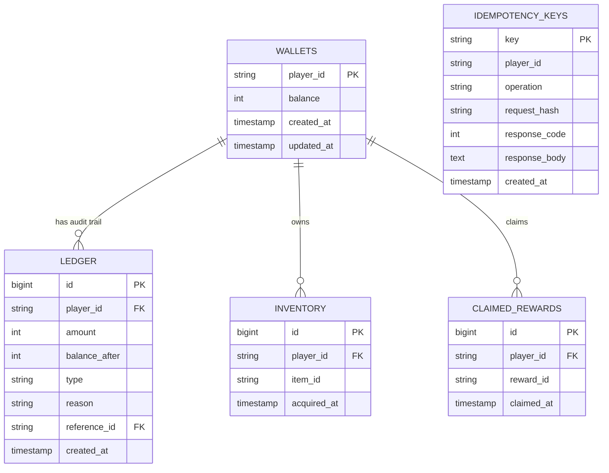

# Arcfield — System Architecture & Design Decisions

This document details the architectural decisions, database design, and durability guarantees of the Arcfield Durable Game Economy Service.

---

## 1. Idempotency Key Design & Scoping

To guarantee exactly-once execution for mutating API requests (such as credits, debits, or purchases), we require clients to supply a unique `Idempotency-Key` (UUIDv4) header.

### Scoping and Payload Mismatch Detection
* **Key Scoping:** Idempotency keys are scoped **globally by key** in the database. The `idempotency_keys` table uses the client-provided key as the primary key constraint.
* **Payload Fingerprinting:** To prevent a client from using the same idempotency key for two different requests (e.g. crediting a different amount or playerId), we calculate a SHA-256 request fingerprint hash:
  `request_hash = SHA256(HTTP_METHOD + PATH + SERIALIZED_BODY)`
* **Replay vs. Mismatch Error:**
  - If a incoming request matches an existing key and the stored `request_hash` is identical, the system bypasses the business operation and replays the stored response (status code and body) deterministically.
  - If the `request_hash` does not match, the request is rejected with `400 Bad Request` to notify the client of the key reuse bug.
  - If the operation is currently executing in another transaction, concurrent requests block on the database constraint lock and eventually replay the completed response once the holding transaction commits.

---

## 2. Database Schema, Constraints & Indexing

The schema is built in PostgreSQL 16 and managed via SQLAlchemy and Alembic.

### Entity Relationship & Tables



### Essential Constraints & Indexes
1. **`wallets` check constraint:**
   - `chk_wallet_balance_non_negative`: `balance >= 0` ensures wallet balances can never drop below zero at the database level.
2. **`ledger` check constraint & indexes:**
   - `chk_ledger_balance_after_non_negative`: `balance_after >= 0` validates audit trail consistency.
   - `idx_ledger_player_id`: Index on `player_id` to speed up audit logs query.
   - `idx_ledger_reference_id`: Index on `reference_id` (the idempotency key) for tracking transactions.
3. **`claimed_rewards` constraints:**
   - `uq_player_reward`: Unique constraint on `(player_id, reward_id)` guarantees each player can claim a specific reward at most once.
4. **`idempotency_keys` index:**
   - `idx_idempotency_keys_created_at`: Index on `created_at` to allow rapid range queries for the background pruning cleanup.

---

## 3. Transaction Isolation & Concurrency Control

We evaluated three database transaction isolation levels for handling wallet mutations:

| Isolation Level | Read Skew / Phantoms | Write Skew | Performance | Application Overhead |
|:---|:---|:---|:---|:---|
| **READ COMMITTED** | Possible | Possible | **High** | Low (Default DB state) |
| **REPEATABLE READ** | Prevented | Possible | **Medium** | Medium (Requires retrying aborts on write conflicts) |
| **SERIALIZABLE** | Prevented | Prevented | **Low** | High (Aborts frequently on concurrent writes) |

### Chosen Strategy: `READ COMMITTED` with Pessimistic Row Locking (`SELECT FOR UPDATE`)

To maximize concurrency and system throughput while maintaining absolute transaction consistency, we use **pessimistic row-level locking**:

1. We insert a new wallet row if it does not exist using `ON CONFLICT DO NOTHING`.
2. We query the wallet row using `SELECT ... FROM wallets WHERE player_id = :id FOR UPDATE`.
3. PostgreSQL acquires an exclusive row-level write lock.
4. Any concurrent transactions attempting to modify or lock the **same** wallet will block at step 2 until this transaction commits or rolls back.
5. Concurrent transactions for **different** players proceed in parallel without any blocking or performance degradation.
6. Check constraints (such as `balance >= 0`) are validated against the actual locked row state, preventing double-debiting.
7. This removes the risk of serialization failures (aborts) seen in `REPEATABLE READ`/`SERIALIZABLE`, removing the need for complex application-level retry logic.

---

## 4. Exactly-Once Transaction Flow

All operations for a single request are bundled within a single SQL transaction block (`async with db.begin()`):

```
Client Request
      │
      ▼
Check UUID & Hash ──────► Database Transaction Starts
                                │
                                ├──► INSERT Idempotency Key (ON CONFLICT DO NOTHING)
                                │       ├──► [New Key]
                                │       │       ├──► INSERT/SELECT FOR UPDATE Wallet
                                │       │       ├──► Update Wallet Balance
                                │       │       ├──► INSERT Ledger Entry
                                │       │       └──► UPDATE Idempotency Key with Response
                                │       │
                                │       └──► [Duplicate Key Conflict]
                                │               └──► Validate Hash & Replay Stored Response
                                │
                                ▼
                   Database Transaction Commits
```

This guarantees **atomicity and crash consistency**: if the application or database crash mid-request, Postgres rolls back the transaction. The idempotency key is not saved, and the wallet balance remains unmodified, allowing the client to safely retry the request.

---

## 5. Idempotency Key Retention & Cleanup

* **Retention Period:** Idempotency keys are kept for **24 hours** (configurable via `idempotency_retention_hours`).
* **Cleanup Mechanism:** A background task runs periodically (default every 1 hour) inside the FastAPI lifespan loop. It executes:
  `DELETE FROM idempotency_keys WHERE created_at < NOW() - INTERVAL '24 hours'`
* **Database Performance:** The index on `created_at` (`idx_idempotency_keys_created_at`) ensures that the cleanup query runs quickly without locking large portions of the table.
