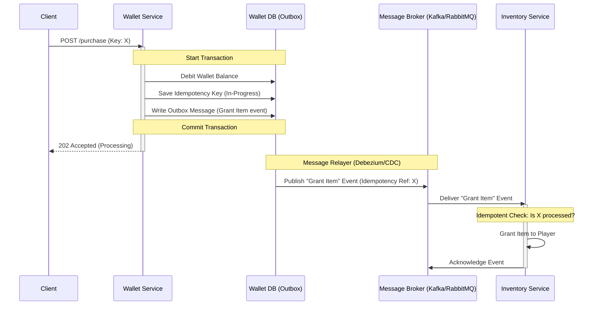

# Arcfield — Distributed Resilience & Eventual Consistency

This document outlines the resilience patterns, distributed transaction management, and recovery strategies designed for Arcfield assuming the inventory domain transitions into a separate, independent microservice.

---

## 1. The Distributed Split & The Partial Failure Window

Currently, wallet debiting and inventory granting happen atomically inside a single database transaction. Once the inventory domain becomes a separate microservice, this database-level atomicity is lost, introducing a **partial failure window**:
1. **Scenario A (Dual Write Failure):** The wallet is debited, but the network call to the inventory service fails.
2. **Scenario B (Double Delivery):** The wallet is debited and the inventory service successfully grants the item, but the network connection drops before returning the response. The client retries the request, leading to potential duplicate grants.

---

## 2. Distributed Consistency Architecture

To guarantee consistency without relying on high-latency two-phase commit (2PC) protocols, we implement an eventual consistency model using **Transactional Outbox**, **Sagas**, and **Idempotent Consumers**.

---

## 3. Core Resilience Patterns

### A. Transactional Outbox Pattern
Instead of calling the inventory microservice directly during the API request, the Wallet service writes a "grant_item" message to an `outbox` table in the *same* database transaction as the wallet debit. 
* A separate, lightweight background process (or Change Data Capture tool like Debezium) polls the `outbox` table and publishes the messages to a message broker (e.g., Kafka or RabbitMQ).
* This guarantees **at-least-once delivery** of the event even if the Wallet service process crashes immediately after committing.

### B. Saga Pattern (Choreographed or Orchestrated)
We manage multi-step distributed operations using a Saga:
1. **Wallet Service:** Debits wallet, writes "ItemPurchaseInitiated" event to outbox.
2. **Inventory Service:** Listens to event, grants the item, and publishes "ItemGranted" event.
3. **Wallet Service:** Listens to "ItemGranted", updates the idempotency record to status `200 OK`.

#### Compensating Transactions (Rollback)
If the Inventory service rejects the grant (e.g., item ID doesn't exist, inventory limits exceeded):
1. **Inventory Service:** Publishes "ItemGrantFailed" event.
2. **Wallet Service:** Listens, performs a **compensating transaction** to refund the player's wallet, creates a ledger entry of type `purchase_refund`, and updates the idempotency record to `409 Conflict` (or similar failure code).

### C. Idempotent Consumers
To handle duplicate delivery from the message broker:
* Every message published contains the original `Idempotency-Key` (reference_id) from the client.
* The Inventory service maintains a `processed_events` table tracking all processed idempotency keys. Before executing a grant, it locks and verifies if the key was already processed, discarding duplicates to prevent duplicate grants.

---

## 4. Reconciliation, Audit, & Detection of Anomalies

Despite robust queue configurations, network partitions or manual operational updates can introduce discrepancies.

### A. Non-Negotiable Invariants
1. **Wallet Balance Invariant:**
   `Current Wallet Balance = Initial Wallet Balance + SUM(Ledger.amount)`
2. **Global Inventory Audit Invariant:**
   `Number of Successful Ledgers (type: purchase_debit) = Number of Granted Inventory Items`

### B. Double-Credit Detection & Audit Trail
An offline daily reconciliation job runs a query comparing the Wallet database ledger state against the Inventory database records.
* Any transaction where the Wallet ledger indicates a debit occurred but no corresponding item exists in the Inventory database (or vice versa) is flagged as an anomaly.
* If a bug causes a double-credit (e.g. refund failed to execute or ledger did not match), it will be detected immediately by the Ledger Invariant checker.

### C. Automated & Manual Correction Strategy
* **Auto-Recovery:** If a transaction is stuck in an in-flight status for more than 15 minutes, the orchestrator triggers a status check query against the Inventory service. If the item was not granted, a compensating refund is applied.
* **Manual Override:** If reconciliation flags an anomaly where a player received an item but no debit occurred (or vice versa), the system locks the player's wallet, writes a correcting ledger record (e.g. `audit_adjustment`), and aligns the balance.

### D. Monitoring & Metrics
* **Queue Lag Monitoring:** Track queue processing lag to detect inventory service degradation.
* **Outbox Processing Latency:** Track the latency between committing the outbox message and it being published.
* **Reconciliation Failure Alerts:** Immediately trigger high-priority alerts to engineering on any balance-ledger mismatches.
